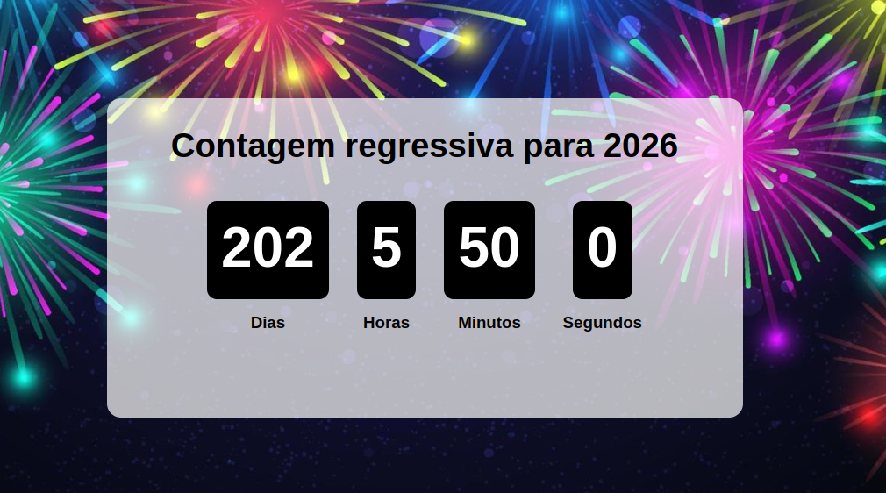

# 📝 Countdown para o Ano Novo

Uma aplicação que faz contagem regressiva para o ano novo desenvolvida em **React.js**.

## 📌 Funcionalidades

- Contagem regressiva precisa (dias, horas, minutos e segundos)
- Atualização automática a cada segundo
- Hook customizado `useCountdown`

## 📸 Demonstração

 <!-- opcional: adicione uma imagem do app rodando -->

## Inicie o servidor de desenvolvimento:
- npm install
- npm run dev
## 🧪 Tecnologias utilizadas

- [React](https://reactjs.org/)
- HTML5
- CSS3
- JavaScript (ES6+)
- Vite

🧠 Aprendizado
Projeto desenvolvido com base no conteúdo do vídeo:

🔗 [PROJETO DE CONTAGEM REGRESSIVA COM REACT JS (YouTube)](https://www.youtube.com/watch?v=uYSV4w1FFnE)
